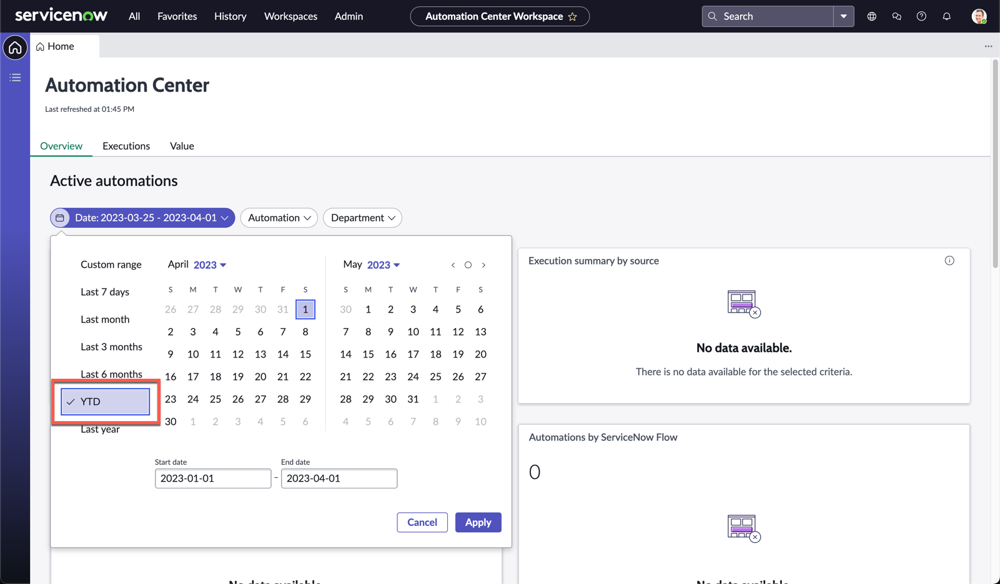
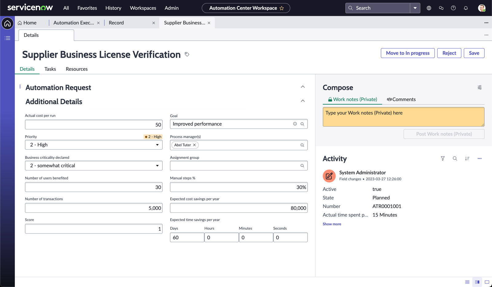

# Exercise 1: Automation Center

We start off by understanding how this automation request was submitted. One of your colleagues within the Supplier Management function in Finance went to the Employee Center to submit an Automation Request. You can see how the form was filled and submitted in the image below.

## Starting work on the request

Automation Center enables organizations to discover, prioritize, and manage automation requests from different sources through the full life cycle in a single workspace. Let's progress this automation request.

1. Under **All**, search and navigate to **Automation Center Home**

    

1. Click on the date range, then select **YTD**, this will filter the data to update widgets

    

    >Note: These are all demo data and might not be up to date. In a production instance, these will be tracked in real time across all onboarded automation tools

1. Take a short moment to look around and orientate yourself with the Automation Center workspace

1. Scroll to the bottom and review the **Most recent requests** section

1. You will see the list of automation requests from the business. Click **Supplier Business License Verficiation** (this was the request raised by the Supplier Management team mentioned earlier)

    

1. Review the record. You will notice that there two different sections

1. The **Automation Request** section are the details that were created from the business user

1. The second section, **Additional Details**, contain the information to derive the financial impact of the planned automation to implement, and will cascade down to different metrics we see on the home page

1. Assume that you have already interviewed the supplier management team, and these are the value projections. You now have a way to track the success of this automation as it is deployed and in use

    

1. Click **Move to In progress** on the top right of the form.

    

That's it for exercise 1! Automation Center will now be your hyperautomation dashboard to track and measure all automation activities within Nintech Co. Now let's get to the actual tools used to automate this process and deliver on the request.

### ***You can now add Automation Center to your Hyperautomation toolbox.***