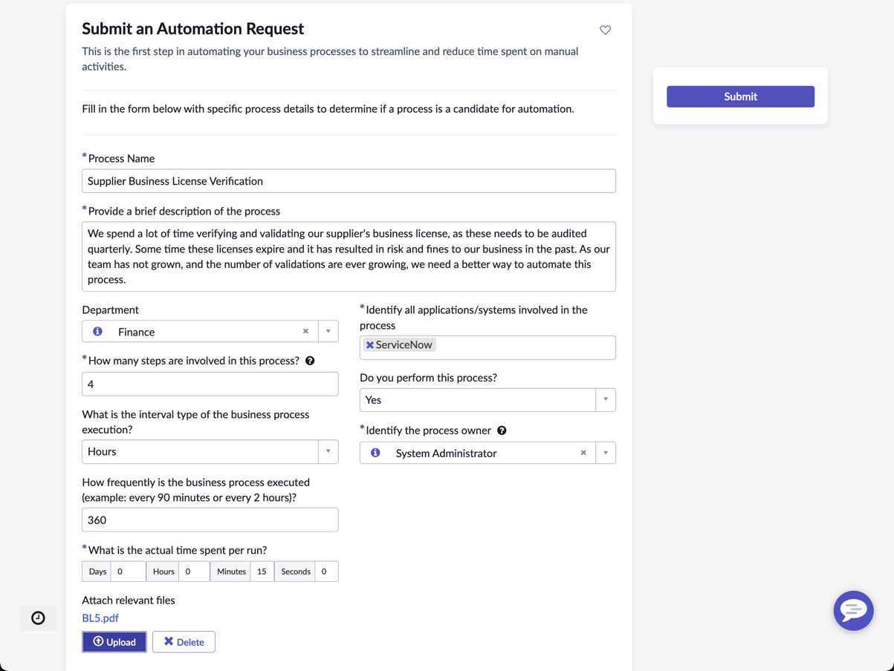
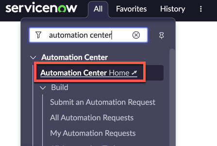
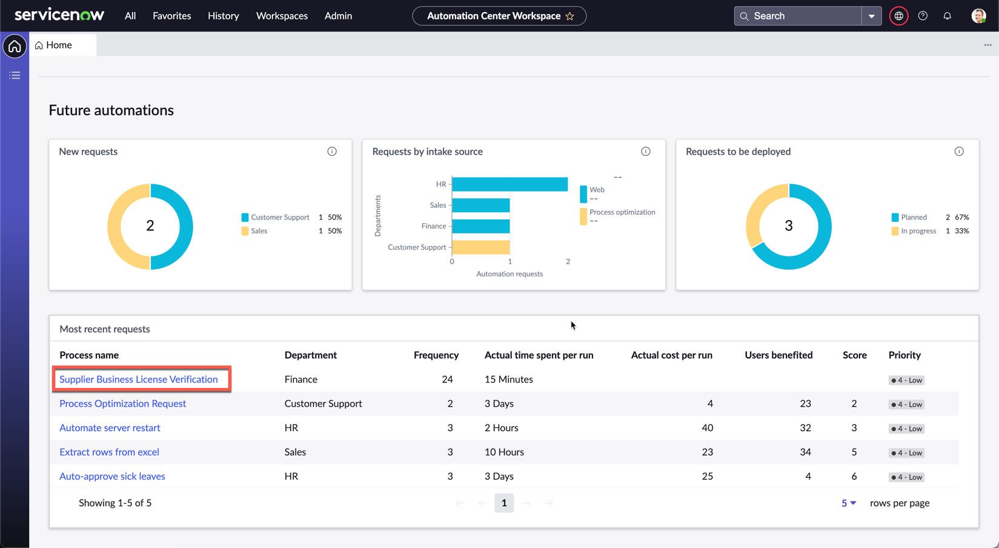
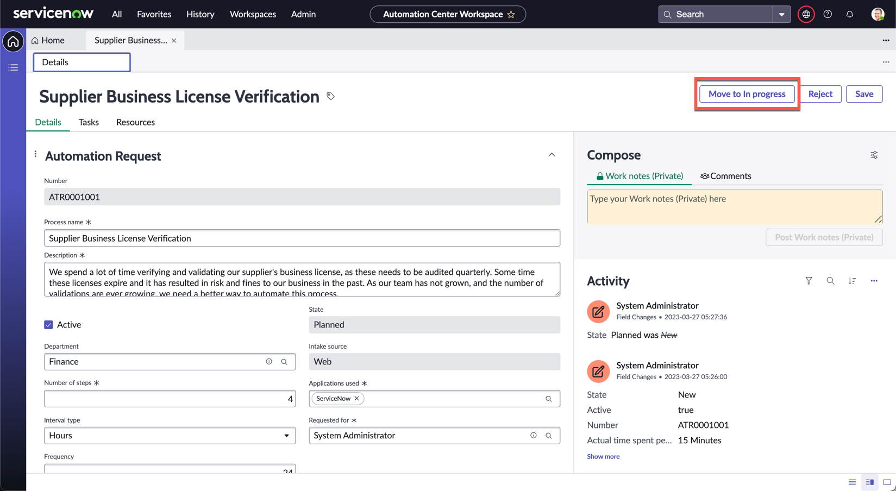

# Exercise 1: Automation Center

We start off by understanding how this automation request was submitted. One of your colleagues within the Supplier Management function in Finance went to the Employee Center to submit an Automation Request. You can see how the form was filled and submitted in the image below.

## Starting work on the request

Automation Center enables organizations to discover, prioritize, and manage automation requests from different sources through the full life cycle in a single workspace. Let's progress this automation request.

1. Under **All**, search and navigate to **Automation Center Home**

    

1. Take a short moment to look around and orientate yourself with the Automation Center workspace

1. Scroll to the bottom and review the **Most recent requests** section

1. You will see the list of automation requests from the business. Click **Supplier Business License Verficiation** (this was the request raised by the Supplier Management team mentioned earlier)

    

    Quickly review the record. You will notice that there are multiple fields filled in. These different fields will allow you to calculate the value of the automations that we will implement, and will impact the metrics on the workspace dashboard

1. Click **Move to In progress** on the top right of the form.

    

That's it for exercise 1! Automation Center will now be your hyperautomation dashboard to track and measure all automation activities within Nintech Co. Now let's get to the actual tools used to automate this process.

### ***You can now add Automation Center to your Hyperautomation toolbox.***