# Exercise 2: Document Intelligence

One of the biggest challenges in Nintech's supplier management process is keeping track of and processing business licenses. Nintech tracks these licenses manually on separate excel spreadsheets, and when suppliers email in new certificates, it is often overlooked and results in compliance risk. In this exercise, we will automate this process by using Document Intelligence to process the licenses using machine vision.

> In the interest of time, several sections of the Supplier Management custom app has already been built for you. For context, a "Business License" table was created to store the business license records.

## Creating an email flow to process attachments

The first part requires us to get the attachments to process via emails from suppliers.

1. Under **All**, search and navigate to **App Engine Studio**

    

1. In the **My recent apps** section, click **Supplier Management**

    

1. You should notice that there are already application files present, such as tables and some pre-built flows

1. Under **Logic and Automation**, click **Process Supplier Email**

    

    A portion of this flow was already built to create a new **Business License** record on the custom table. We now have to complete it to shift email attachments onto the record.

1. Expand the Trigger condition by clicking **Inbound Email**

    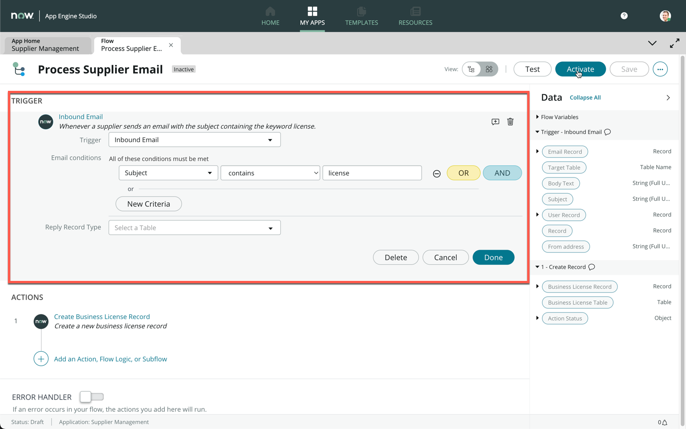

1. Examine and understand the email condition that will trigger the flow (Whenever a new email with the subject containing the keyword "license")

1. The first step of the flow will create a new **Business License** record

1. Click **Add an Action, Flow Logic, or Subflow**

    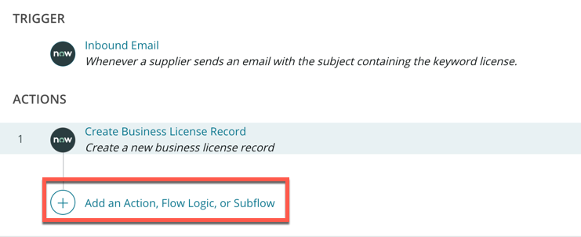

1. Click **Action**, then search **Move email attachments**

1. Click **Move email attachments to record**

    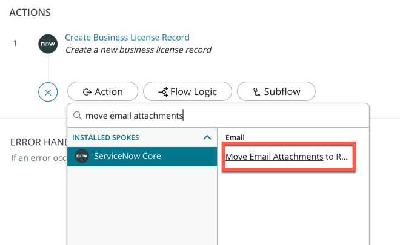

1. Drag and drop the **Email Record** data pill from the right data panel onto the **Email Record** field

1. Drag and drop the **Business License Record** data pill from the right data panel onto the **Target Record** field

    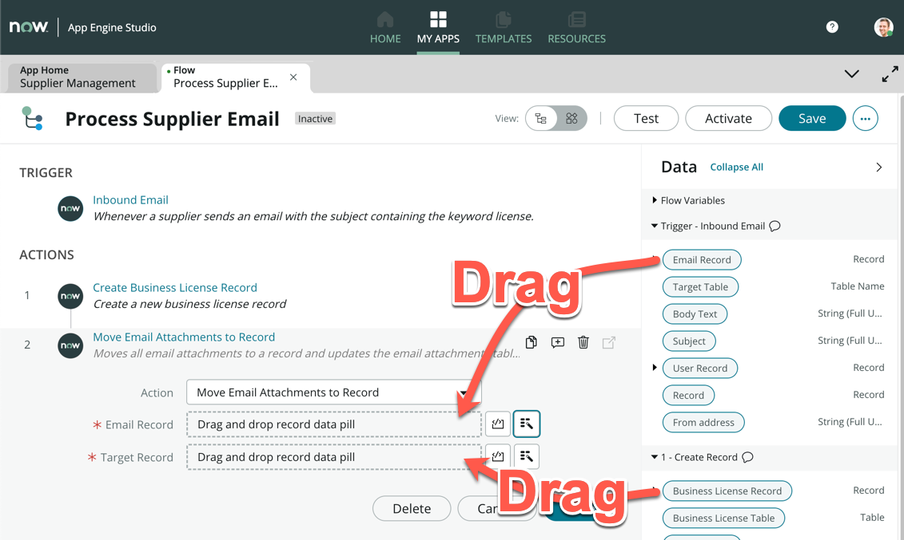

1. The action step will look like this once completed

    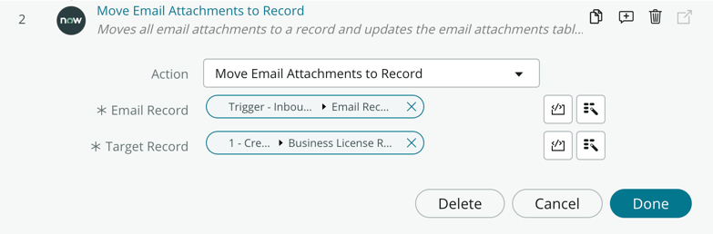

1. Click **Done**

1. Click **Activate** on the top right of the screen

    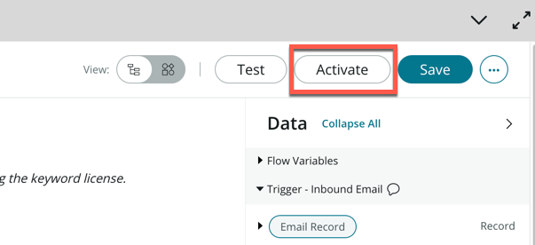

## Processing the attachment via Document Intelligence

The second part walks through the processing of the business license using Document Intelligence

> Note: Lab instances are not enabled to connect to ServiceNow training servers for AI/ML, hence the actual training of the document intelligence models has already been processed. This section is meant to simulate how document intelligence would function in a production ready ServiceNow instance with AI/ML enabled.

1. Navigate back to the main ServiceNow UI

1. Under **All**, search **Document Intelligence**, then click **Use Cases**

    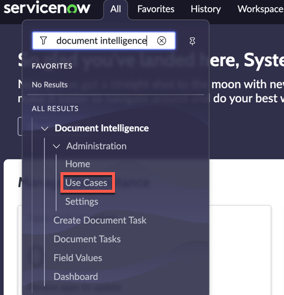

1. In the list view, click **Business License**

    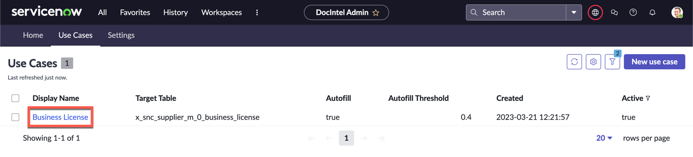

1. If this is your first time using Document Intelligence, here is a quick explanation of the major components you see.

    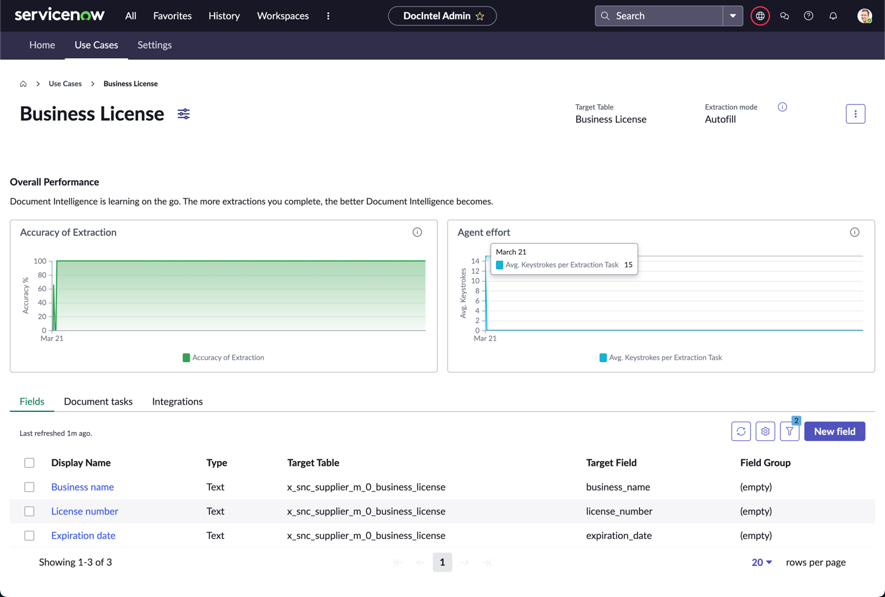
    
    * Accuracy of Extraction: The Accuracy of Extraction widget shows the average extraction accuracy per time period for the selected use case. Accuracy is defined as the number of times that the AI's top recommendation is the correct answer.
    * Agent effort: The Agent effort widget shows the number of keystrokes that your agents need perform to extract all field values for a document task. This measurement is an average per document task.
    * Fields: Each field represents a single piece of information to extract from a document
    * Document task: A document processing activity. Includes the information that you want to extract from the document or documents.
    * Integrations: Integration to trigger document task processing or value extraction. Integrations can be used to quickly set up flows with other applications.

1. Click the **Document Tasks** tab (1)

1. Click the first record (2) to open the **Edit the document Task** modal

    

1. On the pop-up modal, click **Open in Document Intelligence**

    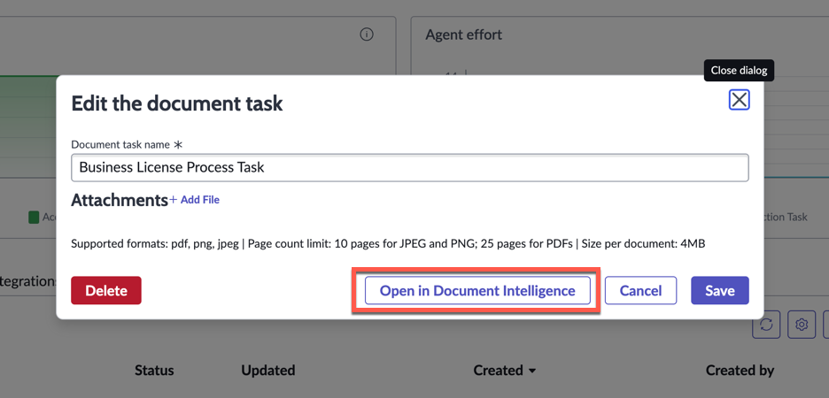

1. A new tab will open, with the Document Intelligence Workspace loaded

    The Document Intelligence Workspace is used for field extraction, searching for recommendations, flagging fields, and identifying missing fields to complete document processing.

1. On the right panel, expand the **Fields** section and click on any field (these are the same 3 fields you saw in the Document Intelligence use case page on the **Fields** related list)

    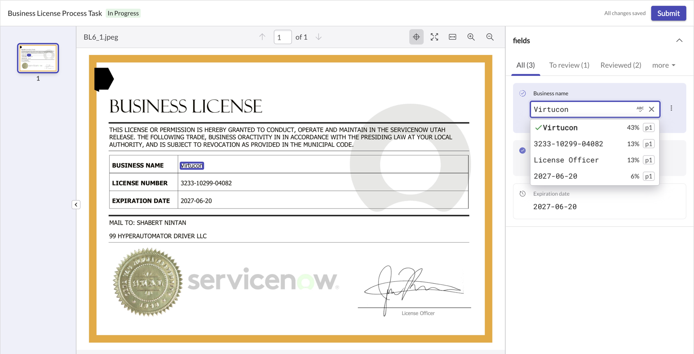

1. Notice how there is a percentage score next to each choice in the list. That is the prediction confidence of the extracted value

1. Hover on a few other choices in the list and see what is being picked up on the Business License image

    >(Optional) Enter any word you see from the business license image, and hover on it under the list. This is how you would manually train the AI model, and would be part of the data set once this document in submitted by clicking the button on the top right.

1. Close this browser tab without submitting

1. Ensure you are on the **Business License** browser tab

1. If the modal is still open, close it

1. Click the **Integrations** tab (1)

1. There are two flows here that need to be created in order to process the document and write the fields to our Business License record: **Process Task** and **Extract Values**

1. Click **DocIntel Task Processing Flow - Business License - Business License Process Task** (2)

    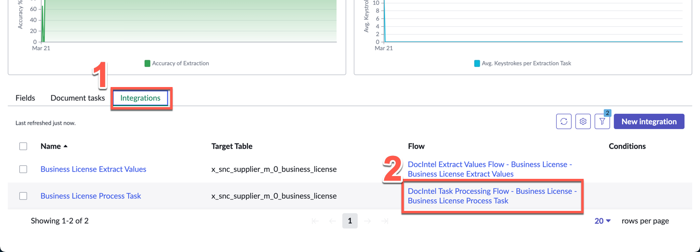

1. A new tab will open with Flow Designer

1. Take a moment to understand what this flow does 

    > Explanation: Whenever a Business License record is created, it will create a Document Intelligence task to process the attachments against the record. If you recall in the first half of this exercise, the supplier's inbound email containing the attachment of the business license will then trigger this flow, dynamically processing these tasks everytime an email is received.

    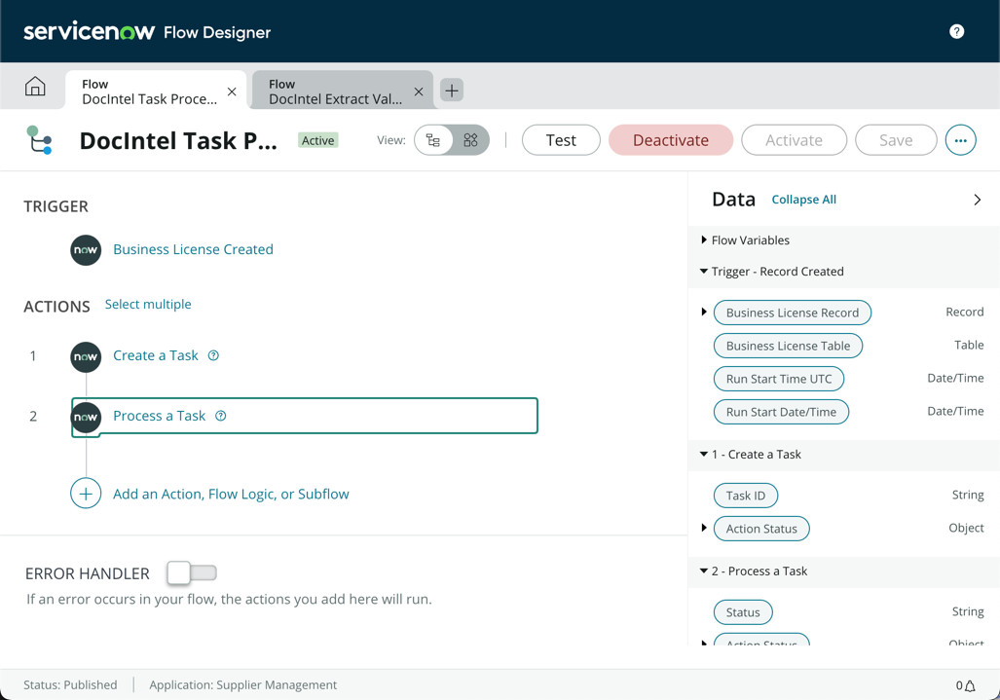

1. Close the browser tab and ensure you are back on the **Business License** use case screen

1. This time, click the **DocIntel Extract Values Flow - Business License - Business License Extract Values** flow

    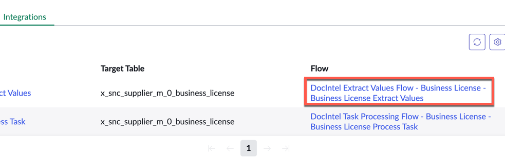

1. On this flow, are you able to decipher what it does on your own? (Hint: It is triggered after the **Process Task** flow)

    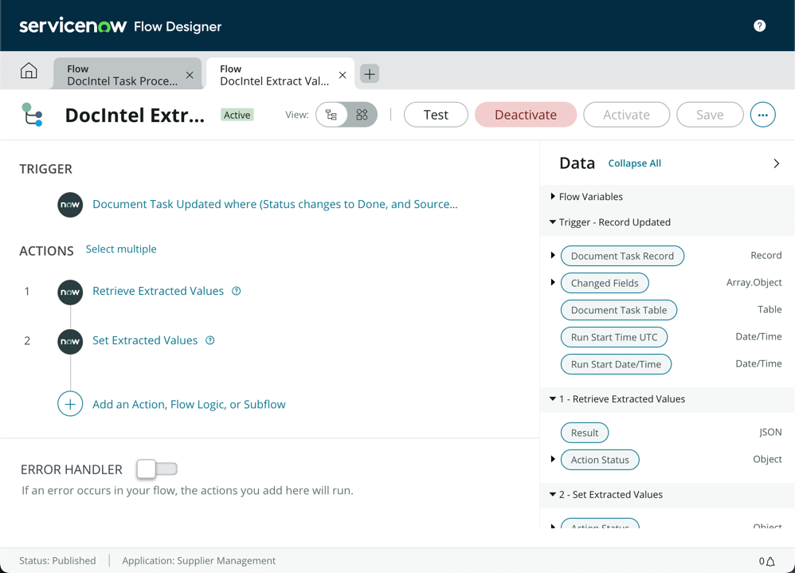

1. Close the browser tab and retun to the **Business License** use case screen

Well done! In this exercise, you have automated the incoming supplier business license requests by creating an email flow to process the email and extract the attachments, and then understand how the attachment will be automatically processed by Document Intelligence. This will go a long way in saving the manual effort of the Supplier Management team and allow them to expand to other document types and use cases.

### ***Go ahead and put Document Intelligence in the AI/ML tray of your Hyperautomation Toolbox***