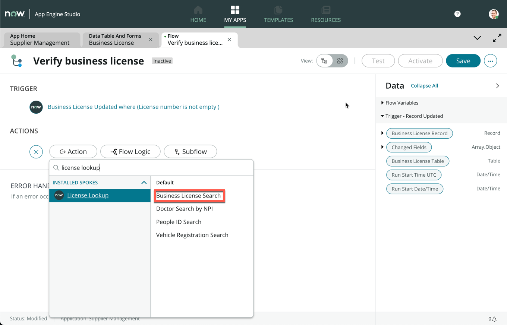
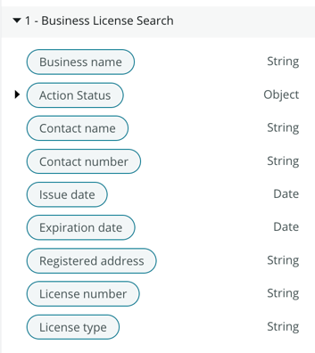
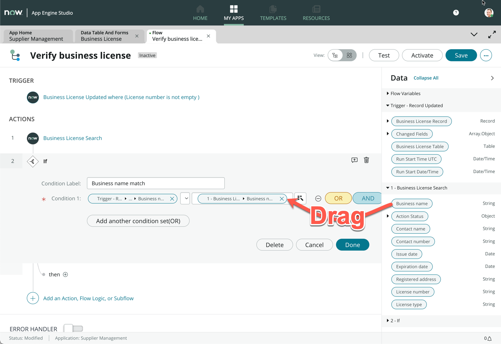

# Exercise 3: Integration Hub

During the discovery interviews with the Supplier Management team, it was often mentioned that they spend a significant amount of time checking the supplier's business registration against the local business registries. This requires them to manually log into the business license portal and to pull out the license information and manually verify one by one. Fortunately, the business license registry offers an API to get information from each license number that we can use to make this process seamless, which we will use in Integration Hub.

> In the lab, we will simulate calling the API, which is modeled after an actual API provider: License Lookup. Check it out here: https://apis.licenselookup.org/business-license-search-api/

## Adding a new field to our custom table

We first have to add a field to our custom **Business License** table to mark whether the record has been verified.

1. Under **All**, search and navigate to **App Engine Studio**

    

1. In the **My recent apps** section, click **Supplier Management**

    

1. Under **Data**, click the **Business License** table

    

1. In the Table Builder view, click **+ Add new field**

    

1. Under **Column label**, enter **Registry verified** (1)

1. On the same row, under **Type**, change the value from **String** to **True/False** (2)

1. Click **Save** on the top right of Table Builder (3)

    

### ***Table builder comes standard in every Hyperautomation toolbox. Make sure you know how to use it effectively to construct the foundations of your applications: Data Schema***

## Using the business license lookup API

Now that we have the **Registry verified** field to indicate whether a record has been verified, we will use the Business License Search API to populate this field.

1. Navigate back to **App Home** by clicking on the first tab (1)

1. Click **Add** in **Logic and automation** (2)

    

1. Click **Flow**

    

1. On the next screen, click **Build from scratch**

1. On the next screen form, under **Name**, enter **Verify business license**

1. Under **Description**, enter **Call the business license lookup API to verify a supplier business license**

    

1. Click **Continue**

1. Once the flow has finished being created, click **Edit this flow**

1. Close the **Getting Started** pop-up, if it appears

1. Click **Add a trigger**

    

1. We want this flow to be triggered when a record on our Business License table is updated. Choose **Updated** under the **Record** section

    

    > Our trigger condition would be whenever Document Intelligence has processed a document as we saw in Exercise 2. This would be where the Business License Number has been extracted from the attachment.

1. Search and select the **Business License [x_snc_supplier_m_0_business_license]** table under **Table** (1)

1. Click **Add filters** under **Condition** (2)

    > It's important that this flow only runs when the Business License number has successfully been extracted from the license document by Document Intelligence. Add a condition to only run when the License number is not empty.

1. In field selection, select **License number** (2)

1. In operator, select **is not empty** (3)

1. Click **Done** (4)

    

1. Click **Save** on the top right (When working on a flow, save often!)

1. Click **Add an Action, Flow Logic, or Subflow**

1. Click **Action**

1. Search **license lookup**

1. Click **Business License Search**

    

1. From the right data panel, expand **Business License Record**, then drag and drop **License number** onto the **License number** field

    

    > We are passing the license number from our Business License record into the API to retrieve information

1. Click **Done**

1. On the right data panel, examine the **1 - Business License Search** data pills. These are the outputs from the Business License Search API once a license is found

    

    > From these outputs we would like to validate back against the business license that the supplier submitted. This is meant to be illustrative, but you can continue to build additional verification logic if you choose.

### ***Integration Hub provides a way for Application Developers to all build Hyperautomation in a consistent way which ensures the data quality, security and sustainability of integrations. A toolbox essential.***

1. Click **Add an Action, Flow Logic, or Subflow**

1. Cick **Flow Logic**, then click **If**

    

1. Under **Condition Label**, enter **Business name match**

1. Expand the **Business License Record** data pill, then drag and drop **Business name** data pill onto **Condition 1** (1)

1. The operator should be left default as **is** (2)

    

1. From **1 - Business License Search**, drag and drop the **Business name** data pill onto the next field

    

1. Click **Done**

1. Under the **If** branch, click **Action**

    

1. Search **update record**

1. Within the **ServiceNow Core** spoke, click **Update Record**

    

1. Drag the **Business License Record** onto the **Record** field

1. Click **Add field value**

1. Drag and drop the **Business License Record** data pill onto **Record** (1)

1. Click **Add field value**

1. Search and select **Registry verified** (2)

1. Check the box next to the **Registry verified** field to mark as true (3)

    

1. On the top right of the form, click **Activate**

    

Great job on making it to this point. In this exercise, we used a custom integration through Integration Hub to verify the business license. So far, we have successfully managed to automate the retrieval, extraction and verification of supplier business licenses without any manual intervention! What used to be a very repetitive, boring task, which took Nintech Co. hours of work each week is now an automated process that takes less than 2 mins. The Supplier Management team now has more time to focus on work that requires human creativity and personality, like Supplier Relationship Management and working with Suppliers to help meet Nintech Co. and their shared ESG goals.