# Exercise 5: Testing what we built (15mins)

In this final exercise, we will be testing what we built. We will be processing this inbound email attachment from Bluth Company.

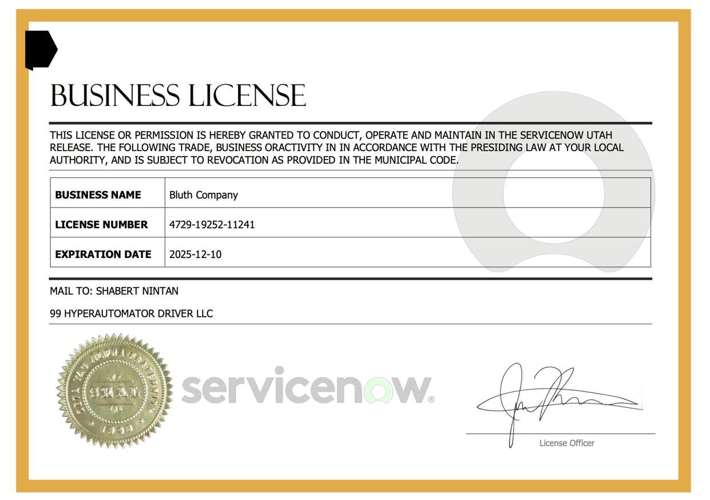

1. Navigate to the main ServiceNow interface

1. Click **Workspaces**, then click **Supplier Management Workspace**

    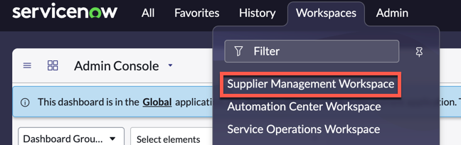

1. You should land on the **Supplier Management Workspace**. This is a simple workspace to currently only handle the business licenses, but will be the starting point for all other Supplier Management applications as well.

    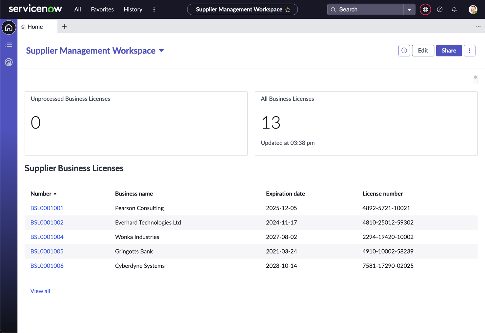

1. Keep this workspace open, we will come back to it after triggering the workflow

1. You can skip the following steps if the App Engine Studio tab is still open

1. Under **All**, search and navigate to **App Engine Studio**

    

1. In the **My recent apps** section, click **Supplier Management**

    

1. Under **Logic and Automation**, click **Process Supplier Email** (If you cannot locate this flow, you might have to expand the list by clicking **See all** on the top right of the section)

    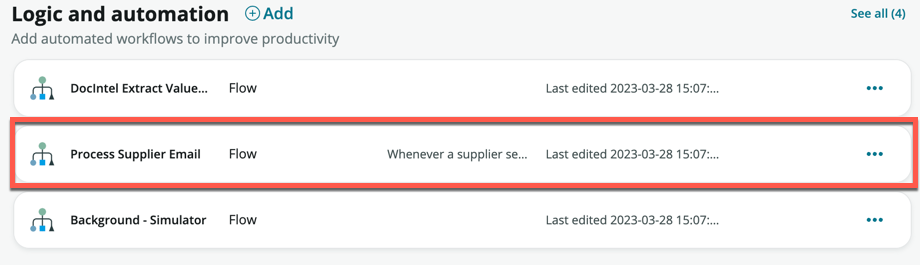

1. Within the **Process Supplier Email** flow screen, click **Test**

    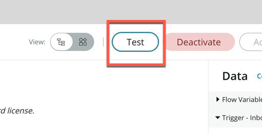

1. For **Email Record**, click the field and search **business license**. You should see one result titled **Business license registration for Bluth Co**

    > This email record was originally sent in by the supplier, and contains the attachment from the email

1. Select it and click **Run Test**

    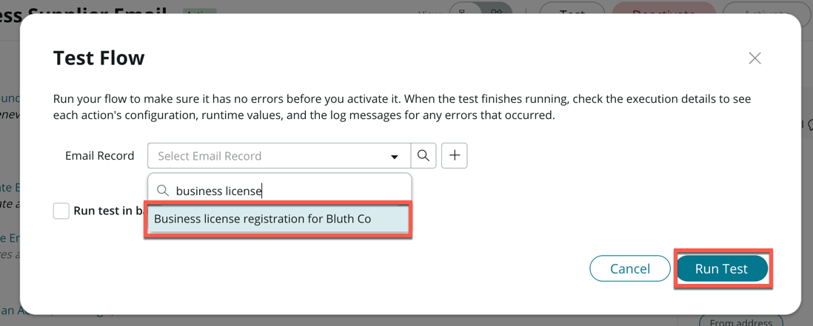

1. Quickly head back to the **Supplier Management Workspace** tab

1. The business license has already begun processing, if you were quick enough, you should be able to see 1 record under **Unprocessed Business Licenses** after clicking the **Refresh** icon

    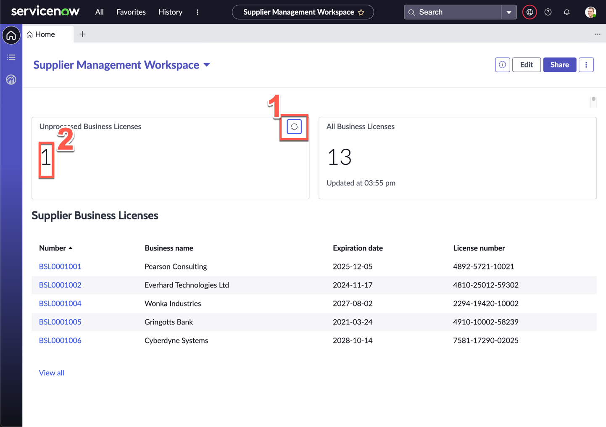

1. Click **1** under **Unprocessed Business Licenses**

1. On the record list, click the record

    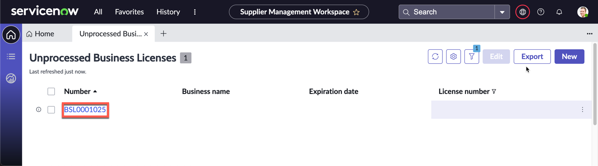

1. On the next record screen, the fields (Business name, License number, Expiration date) should automatically be populated once the document has been processed by Document Intelligence (note: this is simulated and can take up to 3 minutes to process)

1. Confirm that the **Bluth Co Business License** attachment is present on the right

    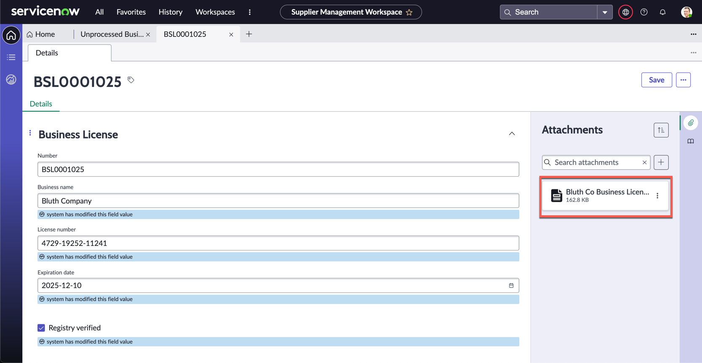

1. Click the **Playbook** icon on the far right of the screen, under attachments

    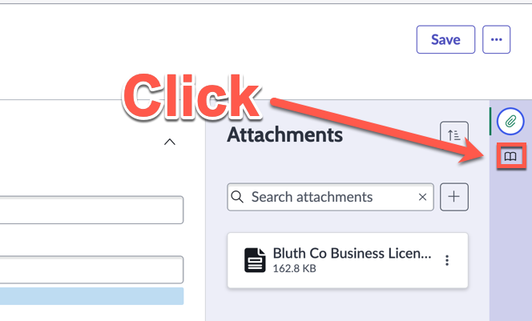

1. The playbook will load (You will have to expand the panel by dragging the divider all the way to the left)

    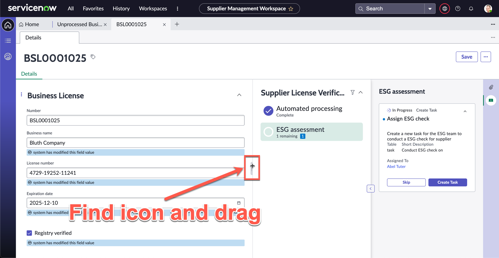

1. Recall how we designed this process in **Process Automation Designer** in Exercise 4

1. If your document has not finished processing, you will have to wait till it is done and before the playbook will progress

1. Once the Assign ESG check step is available, click **Create Task** to assign the ESG check task to Abel Tuter

    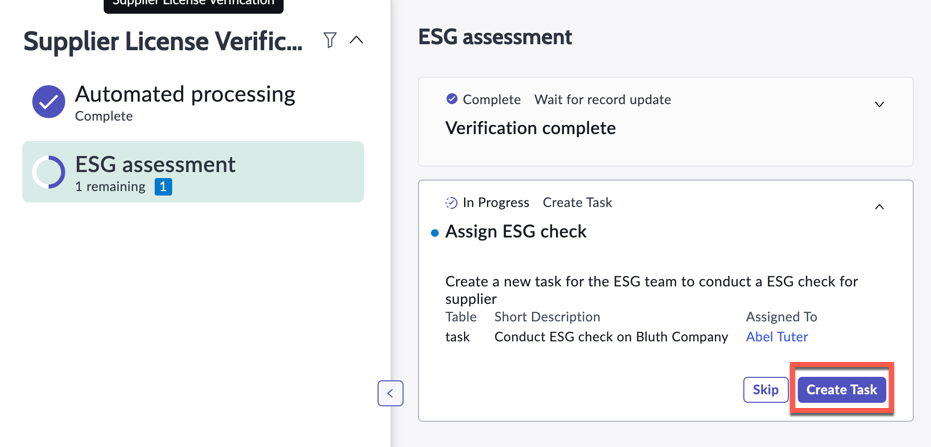

1. You can expand the new task to see the details of the task created by clicking the expand arrow

    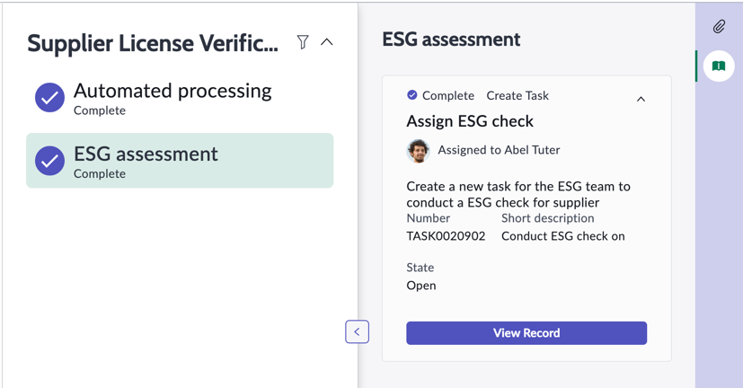

Congratulations, you've completed the lab! What you've just experienced are some of the tools with the Hyperautomation toolbox on the ServiceNow platform. This is only the beginning on what's possible, and there are many more tools that you can explore to further automate processes, such as Process Optimization, Predictive Intelligence, Performance Analytics, Decision Builder, etc.

Where will your Hyperautomation journey take you next?