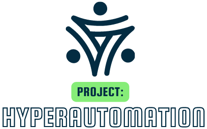
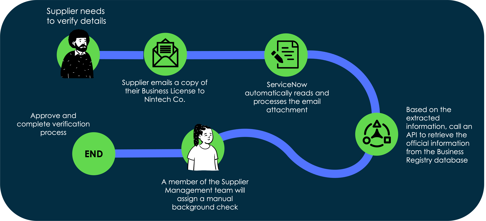

# Introduction

You are a part of the newly formed "Project: Hyperautomation" team within Nintech Co. In a bid to remain competitive, you have been tasked with automating manual processes that have, for years, slowed the company. You have been presented with a backlog of demands from the various business teams, and now need to deliver on these demands using the ServiceNow platform.

One of these demands is to automate processes within the supplier management department. Due to inefficiencies in the past, Nintech Co. has not only suffered from a protracted onboarding cycle for their enormous catalog of suppliers, but also legal and compliance risks regarding the background of these suppliers. With this in mind, you set out to work on this first project to "hyperautomate" the supplier management processes.

You can refer to the end state process flow below:

*Note: This lab is expected to take 90 minutes to complete. All exercises must be completed in sequence.*

[Start!](https://shaoservicenow.github.io/hyperautomation/Exercise%201.html){: .btn .btn-purple }